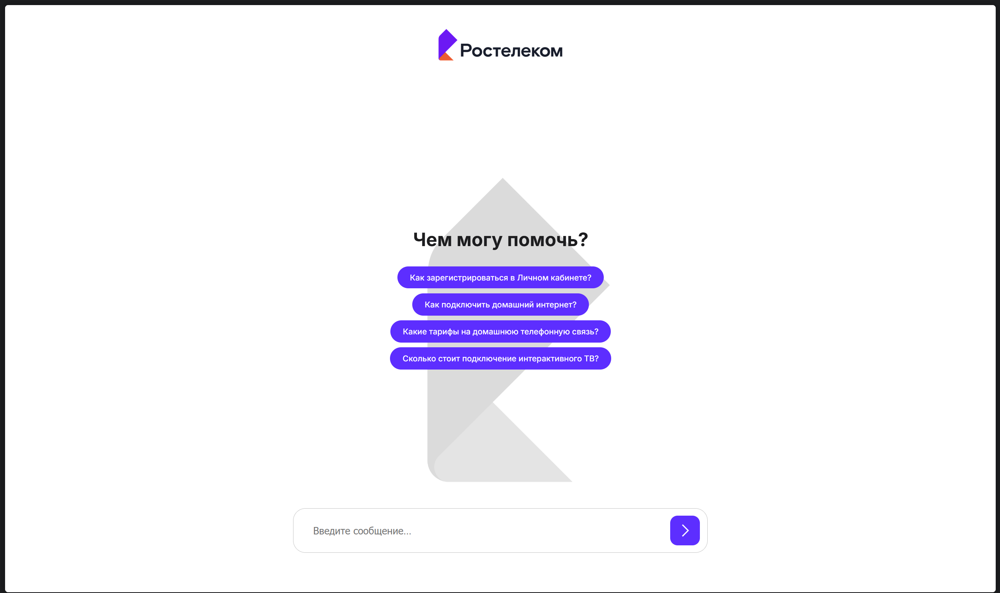
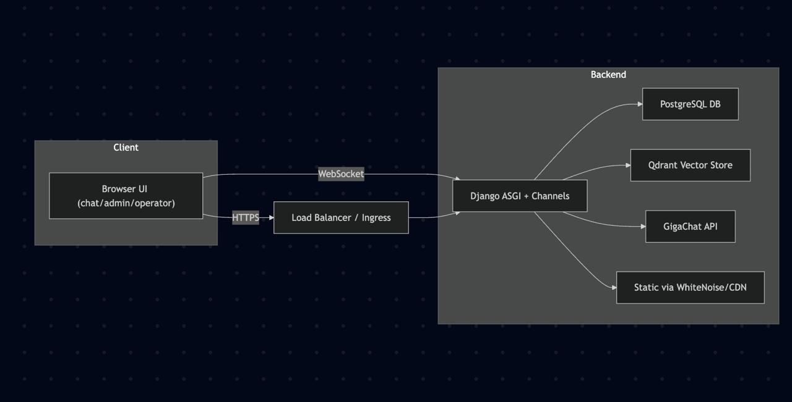
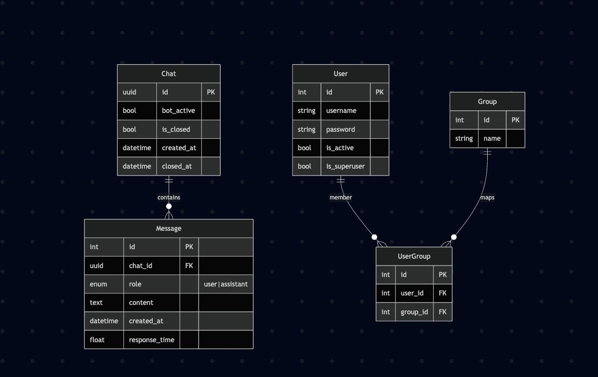
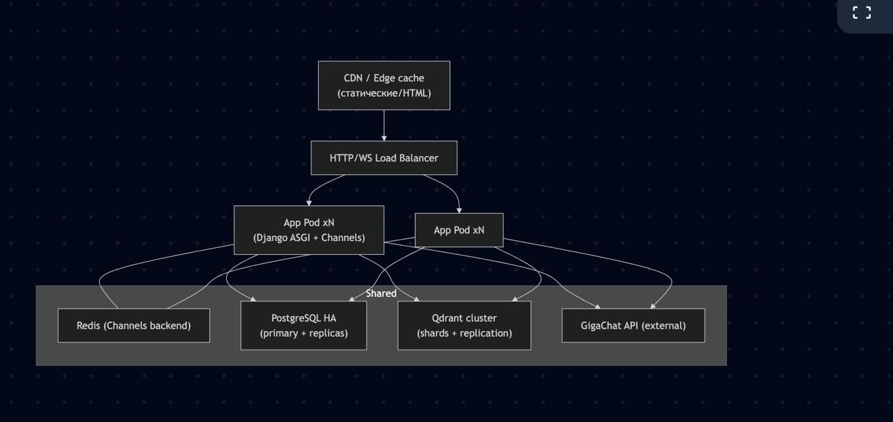
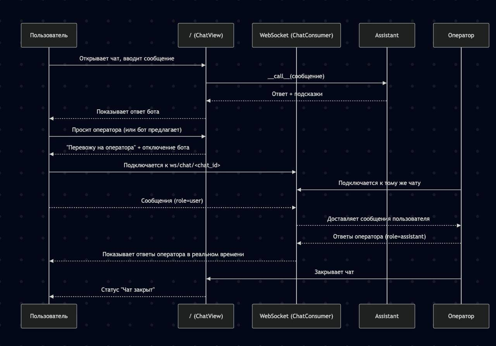
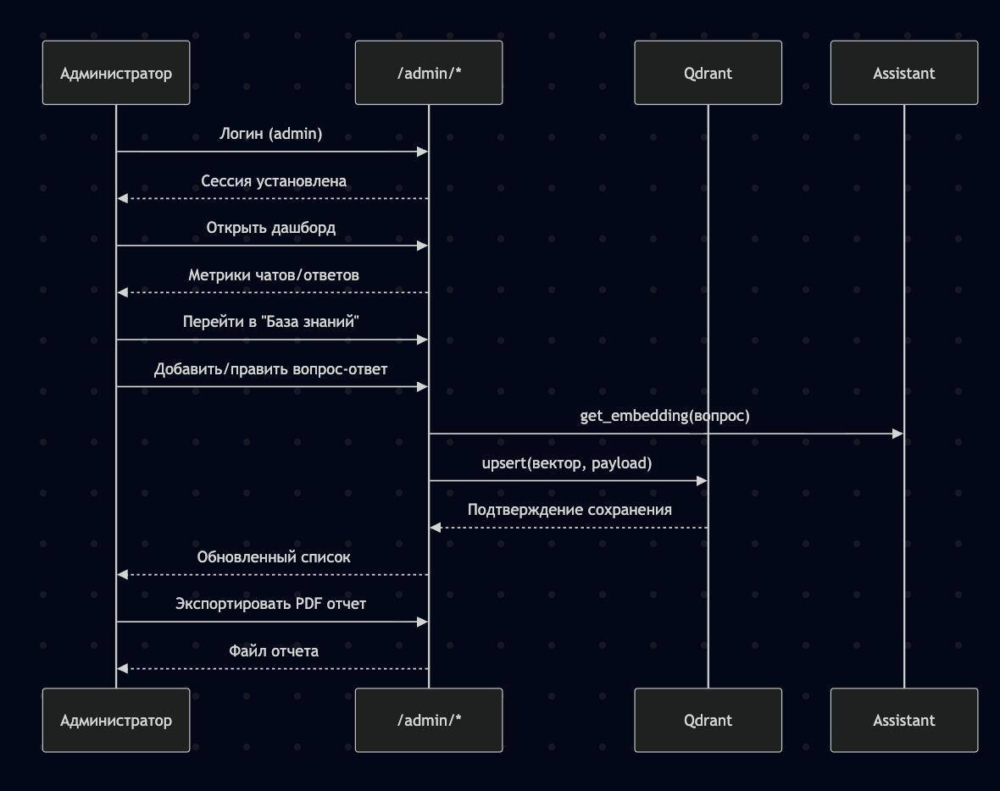
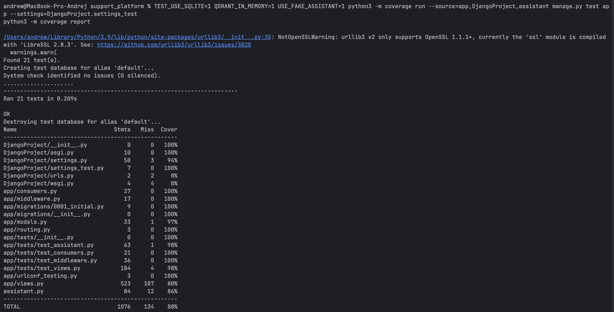

# AI Support Platform


Система поддержки клиентов с чат-ботом, операторской панелью и административным интерфейсом для управления знаниями и персоналом.

## Команда
1. Аниканов Владислав Игоревич - 5130904/30101
2. Колобанов Никита Артемович - 5130904/30101
3. Касеев Андрей Алексеевич - 5130904/30101
4. Житный Дмитрий Александрович - 5130904/30101
5. Мельников Владимир Николаевич - 5130904/30101

## Ссылки
- Репозиторий: https://github.com/Nikzxn/support_platform
- Деплой: локальный или удаленный запуск через Docker Compose.

## Оглавление
- [1. Проблема](#1-проблема)
- [2. Требования и пользовательские сценарии](#2-требования-и-пользовательские-сценарии)
- [3. Архитектура и проектирование](#3-архитектура-и-проектирование)
- [4. Реализация (кодирование и отладка)](#4-реализация-кодирование-и-отладка)
- [5. Unit-тестирование](#5-unit-тестирование)
- [6. Интеграционное тестирование](#6-интеграционное-тестирование)
- [7. Сборка и запуск](#7-сборка-и-запуск-bash--docker)
- [8. Итоги](#8-итоги)
- [9. Связь с этапами разработки](#9-связь-с-этапами-разработки)

---

## 1. Проблема
Необходимо сократить нагрузку на операторов и ускорить предоставление ответов клиентам. Пользователи ожидают точные и своевременные ответы, а также возможность бесшовного перехода на оператора при сохранении истории переписки.

## 2. Требования и пользовательские сценарии
### 2.1 Пользовательские истории
- U1 (клиент): посетитель получает мгновенный ответ на типовой вопрос без ожидания оператора.
- U2 (эскалация): клиент инициирует переключение на оператора при недостаточности ответа бота; история сообщений сохраняется.
- O1 (оператор): оператор видит список активных чатов, отвечает с опорой на подсказки и историю.
- A1 (администратор): администратор пополняет базу знаний, управляет персоналом и формирует отчеты о производительности.

### 2.2 Оценка пользователей и хранения данных
- Плановая аудитория: не менее 10k активных пользователей в сутки, пик — до 2k одновременных сессий.
- Объем переписки: ориентировочно 15 сообщений на чат, до 150k сообщений в сутки.
- Хранение: не менее 5 лет. При среднем размере сообщения 1 КБ — около 55–60 ГБ в год (текст), с резервом 0.5 ТБ на 5 лет с учетом индексов и журналов.

---

## 3. Архитектура и проектирование
### 3.1 Характер нагрузки (оценка)
- Соотношение операций: чтение ~65% (история, подсказки), запись ~35% (сообщения, знания, пользователи).
- Сетевой трафик: чат 1–2 КБ на сообщение, 150k сообщений в день — около 300 МБ в сутки; ответы GigaChat 2–4 КБ.
- Дисковое хранилище: PostgreSQL — расчетно 0.5 ТБ на 5 лет; Qdrant — порядка 150 МБ на 10k Q&A (вектор 1024 float), резерв 5–10 ГБ.

### 3.2 Диаграммы C4
- Контекст: 
- Контейнеры: 

### 3.3 Компоненты и зависимости
- Backend: Django 5.2 (ASGI) + Channels (WebSocket), Uvicorn. Основные модули — `app/views.py` (HTTP), `app/consumers.py` (WS), `app/middleware.py` (ролевой доступ), `assistant.py` (GigaChat + Qdrant).
- Базы данных: PostgreSQL (чаты, пользователи, статистика), Qdrant (векторный поиск по знаниям). Конфигурация задается в `DjangoProject/settings.py`; для тестов предусмотрены `TEST_USE_SQLITE=1` и `QDRANT_IN_MEMORY=1`.
- AI: GigaChat API (completions и embeddings) с передачей токена через `GIGATOKEN` (см. `docker-compose.yml`).
- UI: Web (HTML/CSS/JS) без фронтенд-фреймворков; интерфейсы чат/оператор/администратор в `templates/` и `static/`.
- Внешние API: GigaChat (chat completions, embeddings).
- Статика: WhiteNoise; при необходимости — CDN/edge-cache.

### 3.4 Контракты API и нефункциональные требования
- Публичный чат:
  - `POST /` — сообщение в чат: `{message, chat_id}` → `{reply, suggestions, operator_mode}`; SLO: P95 ≤ 2.5 s (вызов AI включен).
  - `GET /chat/<uuid>/history/` — история сообщений; закрытый чат возвращает 404; P95 ≤ 150 ms.
  - `GET /chat/<uuid>/suggestions/` — подсказки по последним user-сообщениям; P95 ≤ 300 ms (Qdrant in-memory/remote).
  - `POST /chat/<uuid>/close/` — закрытие чата оператором; P95 ≤ 200 ms.
- Оператор: `GET /operator/` — перечень активных чатов (доступ по группе Operators или is_superuser).
- Администратор:
  - `GET /admin/api/stats/?period=N` — агрегаты по чатам (созданные/закрытые).
  - CRUD базы знаний: `GET/POST /admin/api/knowledge/`, `GET/PUT/DELETE /admin/api/knowledge/<id>/`.
  - CRUD персонала: `GET/POST /admin/api/staff/`, `GET/PUT/DELETE /admin/api/staff/<id>/`.
  - `GET /admin/generate-pdf/` — формирование PDF-отчета.
- Нефункциональные требования: доступность не ниже 99.5%, масштабируемость не менее чем в 10 раз, защита административного контура через авторизацию и ролевую модель (Operators/Администраторы). Ролевые проверки реализованы в `app/middleware.py` и в классах-представлениях (`UserPassesTestMixin`).

### 3.5 Схемы данных
- Диаграмма БД: 
- Таблицы: `Chat` (UUID, статус бота/закрытия, временные метки), `Message` (роль user/assistant, содержимое, response_time), стандартные `User/Group` (роль оператора через группу Operators). Схема рассчитана на рост: компактные записи (текст и метаданные), индексы по chat_id и created_at, группировка по чатам, потенциальный горизонтальный шардинг по chat_id. Векторная база знаний хранится в Qdrant (payload: question/answer/related_questions, вектор — embedding GigaChat).

### 3.6 Масштабирование
- Диаграмма: 
- Подход: горизонтальное масштабирование приложений (k8s/Compose replicas) за балансировщиком; Redis как backend для Channels при работе нескольких инстансов; PostgreSQL primary+replicas (разделение чтения/записи), Qdrant cluster (шарды и реплики), CDN/edge-cache для статики и HTML. При росте нагрузки в 10 раз масштабируются app pods, добавляются read-replicas БД; внешние AI-вызовы ограничиваются rate-limit на уровне очередей.

### 3.7 Последовательности
- Пользовательский сценарий чат/оператор: 
- Админ и база знаний: 

---

## 4. Реализация (кодирование и отладка)
- Технологии: Django, Channels (WebSocket), PostgreSQL, Qdrant, GigaChat API, xhtml2pdf, Playwright, Docker/Compose.
- Структура проекта:
  - `app/` — модели, представления, WebSocket-consumers, middleware, тесты.
  - `DjangoProject/` — конфигурация, URL, ASGI/WSGI.
  - `templates/`, `static/` — пользовательский, операторский и административный интерфейсы.
  - `assistant.py` — интеграция с GigaChat и Qdrant.
  - `docker-compose.yml`, `Dockerfile`, `setup.py` — сборка, загрузка базы знаний, запуск.
  - `docs/` — диаграммы C4, схема БД, сценарии взаимодействия, скриншоты покрытия и UX.
  - `utils_qdrant.py` — утилиты для загрузки базы знаний из Excel в Qdrant.
  - `manage.py` — точка входа Django.
- Пример интерфейса: 
- Вклад команды: участники разработали backend (представления, тесты), инфраструктурные компоненты (Docker/Compose) и сценарии тестирования (unit и Playwright).
- Дополнительно:
  - Dockerfile устанавливает системные зависимости для xhtml2pdf и Playwright/Chromium; Uvicorn используется как ASGI-сервер.
  - `setup.py` мигрирует БД, загружает базу знаний из `база знаний.xlsx` в Qdrant и создает суперпользователя admin/admin.
  - `AccessMiddleware` перенаправляет пользователей без роли оператора/администратора на соответствующие формы входа.
  - WebSocket-канал `/ws/chat/<chat_id>/` (`app/routing.py`) записывает сообщения в БД через `ChatConsumer`.

---

## 5. Unit-тестирование
- Покрытие: обработка чата (представления, переключение на оператора), подсказки, административные CRUD знаний/персонала/статистики, middleware доступа, WebSocket consumer, класс Assistant (эмбеддинги, обновление токена).
- Запуск (Docker, без внешних зависимостей AI/DB):
  ```bash
  docker-compose run --rm web bash -lc \
    \"TEST_USE_SQLITE=1 QDRANT_IN_MEMORY=1 USE_FAKE_ASSISTANT=1 \\
     python -m coverage run --source=app,DjangoProject,assistant manage.py test app \\
     && python -m coverage report\"
  ```
- Пример покрытия:  — около 88% Statements (21 тест). Ключевые модули (`DjangoProject/*`, `app/tests/*`) выше 90%. Для тестов используется `USE_FAKE_ASSISTANT=1` и in-memory Qdrant (VectorParams size=3) для изоляции от внешних сервисов.

---

## 6. Интеграционное тестирование
- Сценарий: пользователь открывает чат, отправляет вопрос и получает ответ бота в интерфейсе (закрывает историю U1, использует WebSocket и эмуляцию GigaChat).
- Шаги: поднять стек, дождаться готовности сервера (`wait_for_server`), выполнить сценарий Playwright (переход на `/`, отправка сообщения, ожидание ответа).
- Команда (внутри запущенного контейнера web, Uvicorn на 8000):
  ```bash
  docker-compose up -d
  docker-compose exec web bash -lc "xvfb-run pytest app/tests/integration_test.py"
  ```
- Критерий успеха: тест завершается без ассертов, в журнале присутствует полученный ответ бота. Сценарий запускает Playwright Chromium (headless=false) под управлением xvfb и ожидает появления последнего сообщения бота.

---

## 7. Сборка и запуск (bash + docker)
- Сборка образов: `docker-compose build`
- Миграции и первичная инициализация (локально, включая загрузку базы знаний и создание суперпользователя admin/admin):
  ```bash
  docker-compose run --rm web bash -lc "python setup.py"
  ```
- Запуск приложения: `docker-compose up -d`
- Unit-тесты: команда из раздела 5.
- Интеграционные тесты: команда из раздела 6 (после `docker-compose up -d`).
- Доступ: чат `http://localhost/`, оператор `http://localhost/operator/`, админка `http://localhost/admin/`.
- Конфигурация Docker Compose: web-контейнер публикует порт 80→8000, монтирует `./static`, `./templates`, `./app/tests`; PostgreSQL и Qdrant используют отдельные volume-хранилища и healthcheck. Переменные окружения (включая `GIGATOKEN`, параметры БД и Qdrant) передаются через compose.

---

## 8. Итоги
- Реализовано: чат-бот с эскалацией на оператора, операторская панель, административный интерфейс с управлением базой знаний и персоналом, формирование PDF-отчета, Docker-окружение, unit- и интеграционные тесты.
- Потенциальные улучшения: вынесение Channels backend в Redis для многоподового деплоя, добавление мониторинга (Prometheus/Grafana), кэширования подсказок, ограничения частоты AI-вызовов, SSO для административного контура, проведение нагрузочных тестов и настройка алертинга по SLA.

## 9. Связь с этапами разработки
- Определение проблемы — раздел 1.
- Требования и сценарии — раздел 2.
- Архитектура и проектирование — раздел 3 (C4, БД, масштабирование, API).
- Кодирование и отладка — раздел 4.
- Unit-тестирование — раздел 5.
- Интеграционное тестирование — раздел 6.
- Сборка и запуск — раздел 7.
